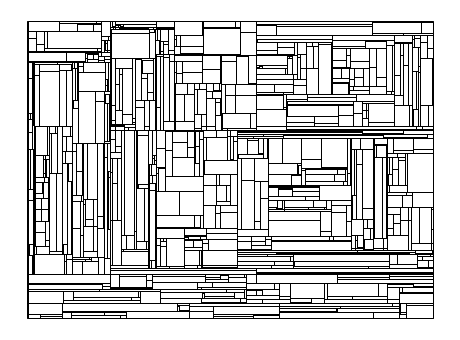

# weighted_planar_stochastic_lattice

## Introduction

Weighted planar stochastic lattices look awesome! Surely the world needs videos of them being constructed.

- This video, generated by `playground.ipynb`, shows how this method constructs these lattices: https://www.youtube.com/watch?v=alE77jzp8vo
- More on WPSLs: https://en.wikipedia.org/wiki/Weighted_planar_stochastic_lattice
- More on Scale-free networks: https://en.wikipedia.org/wiki/Scale-free_network

## Usage

See `playground.ipynb`.
